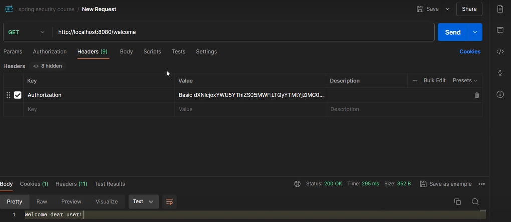
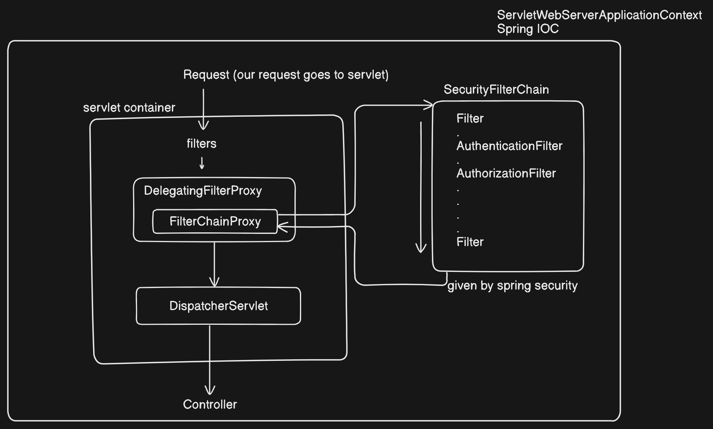

## What is Spring security ?
used to secure your applications at application level.

Spring security does not secure :- 
1. data at rest :- data kept in persistent store
2. data at flight :- some data transmitting over the network

## Setup
**spring-boot-starter-security** starter dependency is used for setup spring security. 
once we use this dependency we will get 401(Unauthorized) if we directly hit controller. 
Because now spring security expecting authorization header. authorization = Basic usename:password (encoded base64 format) 
where username is by default user and password is the one when we run application it gets logged in console. for every application run new password will be generated.

## Architecture of Spring Security

Servlet lifecycle will be managed by servlet container and Spring security filter chain is managed by spring IOC container. 
so now it can't use these filters directly as they are being managed by different entities.

The Servlet container has it's own filter chain which includes DelegatingFilterProxy (automatically registered by spring boot in spring security) 
DelegatingFilterProxy intercepts request and delegates the request to a spring-managed filter bean which is **FilterChainProxy**.

The FilterChainProxy contains multiple filter chains, each of which can be associated with the specific url pattern.
If all filters are successful request reaches to the controller. if any filter blocks the request we get 401 or 403 http response.
