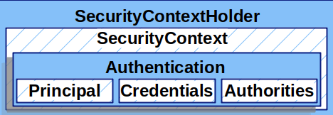
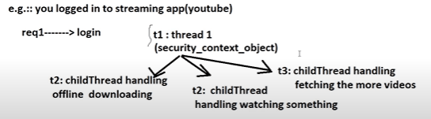
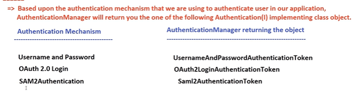
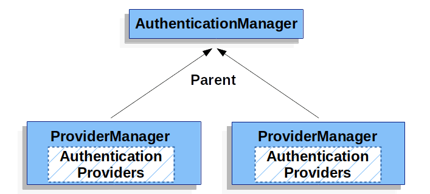
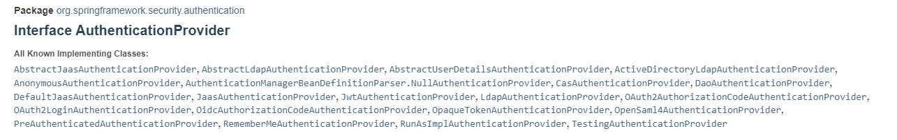
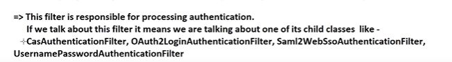

## What is Spring security ?
used to secure your applications at application level.

Spring security does not secure :- 
1. data at rest :- data kept in persistent store
2. data at flight :- some data transmitting over the network

## Setup
**spring-boot-starter-security** starter dependency is used for setup spring security. 
once we use this dependency we will get 401(Unauthorized) if we directly hit controller. 
Because now spring security expecting authorization header. authorization = Basic usename:password (encoded base64 format) 
where username is by default user and password is the one when we run application it gets logged in console. for every application run new password will be generated.

## Architecture of Spring Security

Servlet lifecycle will be managed by servlet container and Spring security filter chain is managed by spring IOC container. 
so now it can't use these filters directly as they are being managed by different entities.

The Servlet container has it's own filter chain which includes DelegatingFilterProxy (automatically registered by spring boot in spring security) 
DelegatingFilterProxy intercepts request and delegates the request to a spring-managed filter bean which is **FilterChainProxy**.

The FilterChainProxy contains multiple filter chains, each of which can be associated with the specific url pattern.
If all filters are successful request reaches to the controller. if any filter blocks the request we get 401 or 403 http response.

# Authentication Spring Security

Authentication verifies the identity of a user (e.g., login with username and password),
while authorization determines what actions or resources the authenticated user is allowed to access (e.g., permissions to view or edit data).

[docs.spring.io/spring-security/reference/servlet/authentication/architecture.html](https://docs.spring.io/spring-security/reference/servlet/authentication/architecture.html)

### Components of Spring Security -
- [SecurityContextHolder](https://docs.spring.io/spring-security/reference/servlet/authentication/architecture.html#servlet-authentication-securitycontextholder)  - The `SecurityContextHolder`  is where Spring Security stores the details of who is [authenticated](https://docs.spring.io/spring-security/reference/features/authentication/index.html#authentication) .
- [SecurityContext](https://docs.spring.io/spring-security/reference/servlet/authentication/architecture.html#servlet-authentication-securitycontext)  - is obtained from the `SecurityContextHolder`  and contains the `Authentication`  of the currently authenticated user.
- [Authentication](https://docs.spring.io/spring-security/reference/servlet/authentication/architecture.html#servlet-authentication-authentication)  - Can be the input to `AuthenticationManager`  to provide the credentials a user has provided to authenticate or the current user from the `SecurityContext` .
- [GrantedAuthority](https://docs.spring.io/spring-security/reference/servlet/authentication/architecture.html#servlet-authentication-granted-authority)  - An authority that is granted to the principal on the `Authentication`  (i.e. roles, scopes, etc.)
- [AuthenticationManager](https://docs.spring.io/spring-security/reference/servlet/authentication/architecture.html#servlet-authentication-authenticationmanager)  - the API that defines how Spring Security’s Filters perform [authentication](https://docs.spring.io/spring-security/reference/features/authentication/index.html#authentication) .
- [ProviderManager](https://docs.spring.io/spring-security/reference/servlet/authentication/architecture.html#servlet-authentication-providermanager)  - the most common implementation of `AuthenticationManager` .
- [AuthenticationProvider](https://docs.spring.io/spring-security/reference/servlet/authentication/architecture.html#servlet-authentication-authenticationprovider)  - used by `ProviderManager`  to perform a specific type of authentication.
- [Request Credentials with AuthenticationEntryPoint](https://docs.spring.io/spring-security/reference/servlet/authentication/architecture.html#servlet-authentication-authenticationentrypoint)  - used for requesting credentials from a client (i.e. redirecting to a log in page, sending a `WWW-Authenticate`  response, etc.)
- [AbstractAuthenticationProcessingFilter](https://docs.spring.io/spring-security/reference/servlet/authentication/architecture.html#servlet-authentication-abstractprocessingfilter)  - a base `Filter`  used for authentication. This also gives a good idea of the high level flow of authentication and how pieces work together.

### Security Context Holder
At the heart of Spring Security’s authentication model is the SecurityContextHolder. It contains the SecurityContext. which you can get by calling static method getContext().

By default, SecurityContextHolder uses a ThreadLocal to store these details, which means that the SecurityContext is always available to methods in the same thread, even if the SecurityContext is not explicitly passed around as an argument to those methods.

**Is this safe ? What if same thread used for next request of other user?**

Yes it is safe as Spring Security’s FilterChainProxy ensures that the SecurityContext is always cleared after the request is processed by that thread.

**So do we create new spring context for each new request from the same user ?**

Yes, for every new request, it re-authenticates the user.

You can configure `SecurityContextHolder` with a strategy on startup to specify how you would like the context to be stored.

**available modes -**

MODE_GLOBAL - single security context object

MODE_INHERITABLETHREADLOCAL - shares parent security context object to the current thread local --> child thread local object. e.g. ecommerce, streaming etc. (will learn this in future)

MODE_THREADLOCAL - it keeps securityContext object in a thread local object.

### Authentication (Interface)
implementation classes OAuth2LoginAuthenticationToken,  JwtAuthenticationToken etc.

The Authentication interface serves two main purposes within Spring Security:

- An input to AuthenticationManager  to provide the credentials a user has provided to authenticate. also it provides authentication object as output.
- the authentication object stored in SecurityContext  represents current authenticated user. Security context does not care about from where authentication object created or with which mechanism it is created or how it is stored in security context. so you are free to choose any authentication mechanism. Often a password. In many cases, this is cleared after the user is authenticated, to ensure that it is not leaked.
### GrantedAuthority
high-level permissions that the user is granted. It is possible to have multiple authorities for single user.

### Authentication Manager (Interface)

Authentication authenticate(Authentication object) this method is used to authenticate user.

Here input authentication object will contain principal and credentials provided by user via UserDetails(interface).

### ProviderManager
ProviderManager is the most commonly used implementation of AuthenticationManager.

ProviderManager is the most commonly used implementation of AuthenticationManager. ProviderManager delegates to a List of AuthenticationProvider instances. Each AuthenticationProvider indicate that authentication is **successful, fail, or indicate it cannot make a decision.** by default it allow a downstream AuthenticationProvider to decide in case of it cannot make a decision. and for failure case it won't pass to next one. but we can configure it to pass on multiple Authentication Providers in case of failure scenario. If none of the configured AuthenticationProvider instances can authenticate, authentication fails with a ProviderNotFoundException, which is a special AuthenticationException.

So we can have multiple AuthenticationProvider each doing some specific type of authentication while exposing single AuthenticationManager bean.

Multiple ProviderManager instances might share the same parent AuthenticationManager. This is somewhat common in scenarios where there are multiple SecurityFilterChain

Example flow:

The user submits a login request with a username and password.
Spring Security creates an Authentication object (like UsernamePasswordAuthenticationToken) without authorities.
The AuthenticationManager passes this object to the AuthenticationProvider.
The AuthenticationProvider checks the credentials and fetches the user’s details, including roles (authorities).
A new Authentication object is created with the user’s credentials, authorities, and marked as authenticated. By default, `**ProviderManager**`** tries to clear any sensitive credentials information from the **`**Authentication**`** object that is returned by a successful authentication **request.  ( so if you are caching authentication object for performance improvement you can configure providerManager in such way or you can have some other solutions)

AuthenticationProviders implementations -

### AuthenticationEntryPoint
a client makes an unauthenticated request to a resource that they are not authorized to access. In this case, an implementation of AuthenticationEntryPoint is used to request credentials from the client.

The `AuthenticationEntryPoint` implementation might perform a [redirect to a log in page](https://docs.spring.io/spring-security/reference/servlet/authentication/passwords/form.html#servlet-authentication-form), respond with an [WWW-Authenticate](https://docs.spring.io/spring-security/reference/servlet/authentication/passwords/basic.html#servlet-authentication-basic) header, or take other action.

request - that resulted in an AuthenticationException
response - so that the user agent can begin authentication
authException - that caused the invocation

### AbstractAuthenticationProcessingFilter
It is the part of SecurityFilterChain.

The `AbstractAuthenticationProcessingFilter` can authenticate any authentication requests that are submitted to it.

In case of failure The SecurityContextHolder  is cleared out. In case of success The Authentication is set on the SecurityContextHolder and RememberMeServices.loginSuccess is invoked.

In case of failure RememberMeServices.loginFail is invoked. (will learn this in future)

