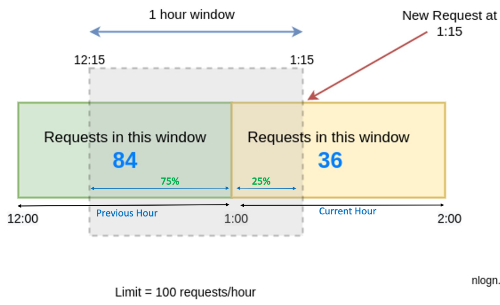

### What is Rate Limiter ?

Rate Limiter or Throttling is the defensive mechanism to ensure the flow of data being send should be at a rate which is acceptable by target machine. 

Three possible things we do in throttling are -  

1. slowing down the rate of consumption for requests
2. rejecting the requests
3. ignoring the requests

API responds Http status code **429** - Too many requests when a request is rate limited or throttled.

### Why do we need rate limiter?

1. To prevent system abuse (Brute force attack, DDoS attack)
2. To only allow traffic that could be handled
3. To prevent cascading failures
4. any application or service that offers an API for developers will have limitations on how many API calls can be made per hour or day by each unique user. In this way, third-party developers don't overuse an API.

### Some famous algorithms used for rate limiting

1. Token Bucket algorithm
2. Leaky Bucket algorithm
3. Fixed window counter algorithm
4. Sliding window logs algorithm

### 1. Token Bucket Algorithm

we have bucket with some maximum capacity of tokens. where periodically we put some number of token in bucket. If bucket is full then extra tokens will overflow. Whenever request comes it will consume one token from bucket. if token is not available then that request will be dropped.

Every bucket has these properties - 
**key** - a unique byte string that identifies the bucket.  
**maxAmount** - the max no. of tokens bucket can hold  
**refill time** - the amount of time between refills  
**value** - current no. of tokens in bucket  
**lastUpdate** - the last time bucket was updated

We use **in memory cache** for this like redis as it's quick.

### Distributed Rate Limiting, Race Condition and Concurrency:

In distributed environment read and then write creates race condition. Suppose Redis has one token left. If two requests are interleaved at the same time, both will be processed. This is not something we want to happen with our rate limiter. In this case, **RedisScripts** (the Lua-scripting language) is used to achieve atomicity _(Atomicity refers to the property of an operation that ensures it is performed as a single, indivisible unit of work. It guarantees that either the operation completes entirely or has no effect at all, preventing intermediate or partial states. Atomicity ensures data integrity and consistency in concurrent and transactional scenarios)_. due to lua script No other operations can run between fetching the count and writing the new count. Redis has the ability to execute Lua scripts on the server side. Lua scripts are executed atomically, that is, no other script or command will run while a script is running.

**Pro -** 

1. Token Bucket algorithm is very simple and easy to implement.
2. Token Bucket algorithm is very memory efficient.
3. Token Bucket technique allows spike in traffic or burst of traffic.

### Companies using this algorithm

Stripe 
Amazon EC2

### References

https://systemsdesign.cloud/SystemDesign/RateLimiter
https://irshitmukherjee55.hashnode.dev/rate-limiting-using-redis-golang-token-bucket-algorithm

### 2. Leaky Bucket Algorithm

Instead of tokens Bucket will be filled by requests. Requests are taken out of the bucket and processed at a constant rate. If the rate at which requests are coming is larger than the rate at which it is processed the bucket will fill up and requests will be dropped.

**Con -** A burst of traffic fills up the queue with old requests, and if they are not processed in time, recent requests will be rate limited.

### Companies using this algorithm

Shopify

### 3. Fixed Window counter

Fixed window counter algorithm divides the timeline into fixed-size windows and assign a counter to each window. Each request, based on its arriving time, is mapped to a window. If the counter in the window has reached the limit then other requests will be rate limiter.

**Adv -** it ensures that most recent requests are served without being starved by old requests

**Con -** if user do 5 requests at 11:00:59 and 5 more requests at 11:01:02. And if our limit window size is 5 requests per minute then as per our example we did 10 requests in 4 sec timeframe.

<pre>
In redis key contains the time also and the value as counter.
request at 10:00:02  redis : "user_1_149000023":1
request at 10:00:20  redis : "user_1_149000023":2
request at 10:02:20  redis : "user_1_149000025":1 (and we expire the 10:00 key)
</pre>

### 4. Sliding window logs algorithm

The fixed window counter algorithm has a major drawback: it allows more requests to go through at the edge of a window. The sliding window logs algorithms fixes this issue.

1. The algorithm keeps track of request timestamps in sorted set.
2. When a new request comes in, remove all the outdated timestamps. Outdated timestamps are defined as those older than the start of the current time window.
3. Add timestamp of the new request to the log.
4. If the log size is the same or lower than the allowed count, a request is accepted. Otherwise, it is rejected.

**Con -** Sliding Window Logs algorithm consumes a lot of memorybecause even if a request is rejected , it's timestamp will still be stored in memory.

### 5. Sliding window counter algorithm

Assume the rate limiter allows a maximum of 100 requests per hour, and there are 84 requests in the previous hour and 36 requests in the current hour. For a new request that arrives at a 25% position in the current hour, the number of requests in the rolling window is calculated using the following formula: 
Requests in current window + (Requests in the previous window \* overlap percentage of the rolling window and previous window)

(36 + (84 \* 75%)) = 99

Since the rate limiter allows 100 requests per hour, the current request will go through.

**Pro -**

1. It smoothes out spikes in the traffic because the rate is based on the average rate of the previous window.
2. Memory efficient

**Con -**  It only works for not-so-strict look back window. It is an approximation of the actual rate because it assumes requests in the previous window are evenly distributed.

However, this problem may not be as bad as it seems. According to experiments done by Cloudflare, only 0.003% of requests are wrongly allowed or rate limited among 400 million requests.

### Few Other Things to Keep in Mind:

If you are consuming an API which is rate limiting, you need to implement proper Retry mechanism in place. Whenever you get 429 Too Many Requests Http Status Code in the API response you should queue up the request to retry and process later.
